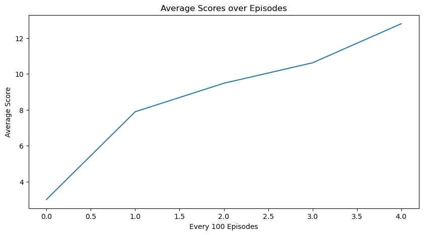
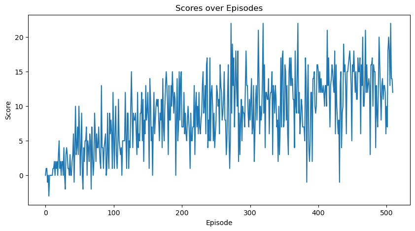

## DRL - Double DQN - Navigation Control

#### Model Architecture

Dueling DQN with 3 hidden layers
- Input: 37 State Values
- FCLayer 1: 128 Units
- FCLayer 2: 128 Units
- FCLayer 3: 64 Units
- Dueling DQN Output Layer

#### Agent

To solve the enviroment the Agent uses a Deep Q-Network with the following techniques:

1. **Experience Replay**: Storing and sampling experiences from a replay buffer to break correlation and enable efficient learning.
2. **Fixed Q-Targets**: Using a separate target network to provide stable targets during learning.
3. **Double DQN**: Decoupling the selection of the action from the evaluation to reduce overestimation bias.
4. **Dueling DQN**: Separating the estimation of state value and advantage for better policy evaluation.

## Possible Improvements

Implementing these techniques could potentially improve performance:

1. **Prioritized Experience Replay**: Sampling more important transitions more frequently, which can improve learning efficiency.
2. **Learning from Multi-Step Bootstrap Targets**: Using n-step returns to provide more informative updates.
3. **Distributional DQN**: Learning a distribution over Q-values instead of just the expectation.
4. **Noisy DQN**: Incorporating noisy linear layers for exploration, which can lead to better performance in environments with high uncertainty.

### Model Hyperparameters
- Gamma: 0.99
- TAU: 0.001
- Update Every: 4
- Batch Size: 64
- Buffer Size: 50000
- Learning Rate: 0.001

## Results and Future Work
The current configuration solved the task in 410 episodes.

